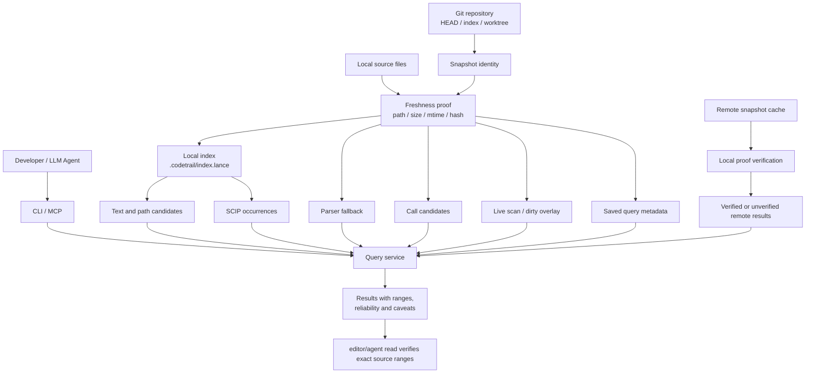

# CodeTrail
[](https://github.com/mars167/CodeTrail/releases)
[](https://www.npmjs.com/package/@mars167/codetrail)

[English](README.md)

基于本地索引的代码搜索工具，专注于快速定位可验证的源码证据。

CodeTrail 的核心承诺不是“理解代码”，而是快速给出可验证的代码证据：搜索、路径定位、范围读取、定义、引用、调用候选、索引状态和 MCP 工具输出都围绕可读取的结果、分页和 caveats 组织。

## 安装

NPM:

```bash
npm install -g @mars167/codetrail
```

macOS/Linux:

```bash
curl -fsSL https://raw.githubusercontent.com/mars167/CodeTrail/main/install.sh | sh
```

Windows PowerShell:

```powershell
irm https://raw.githubusercontent.com/mars167/CodeTrail/main/install.ps1 | iex
```

安装器会根据当前系统下载最新 GitHub Release 资产，校验 `SHA256SUMS`，并安装 `codetrail`。Release 二进制覆盖 macOS amd64/arm64、Linux amd64/arm64 和 Windows amd64/arm64。macOS/Linux 默认安装到 `~/.local/bin`，Windows 默认安装到 `%LOCALAPPDATA%\Programs\codetrail\bin` 并写入用户 `PATH`。

安装指定版本：

```bash
curl -fsSL https://raw.githubusercontent.com/mars167/CodeTrail/main/install.sh | sh -s -- --version v0.1.4
```

```powershell
$env:CODETRAIL_VERSION = "v0.1.4"; irm https://raw.githubusercontent.com/mars167/CodeTrail/main/install.ps1 | iex
```

### Windows 故障排查

如果在 PowerShell 或 Git Bash 中执行 `codetrail` 没有任何输出且立即返回，先查看退出码：

```powershell
codetrail --version; $LASTEXITCODE
```

退出码为 `-1073741515`（`0xC0000135`，STATUS_DLL_NOT_FOUND）表示 Windows 加载器在程序打印任何内容之前就终止了进程。v0.1.6-beta.2 及更早版本动态链接 MSVC C 运行时，依赖 [Visual C++ Redistributable](https://learn.microsoft.com/cpp/windows/latest-supported-vc-redist) 提供的 `VCRUNTIME140.dll`，而干净的 Windows 11 系统并不自带该 DLL。之后的版本改为静态链接 CRT，二进制完全自包含——升级到最新版本即可解决，无需额外安装运行库。退出码为 `-1073741795` 通常表示二进制架构与机器不匹配，请设置 `CODETRAIL_ARCH` 为 `arm64` 或 `amd64` 后重新安装。

## 快速开始

```bash
codetrail index build
codetrail find "TODO"
codetrail defs main
```

默认输出是短文本；需要机器读取时使用 `--output json` 或 `--output jsonl`。编辑前请用编辑器或 Agent read 工具验证精确源码范围。命令参数以 `codetrail --help` 和 `src/cli.rs` 为准。

## 常用命令

内容与路径搜索：

```bash
codetrail find "TODO"
codetrail grep "fn [a-z_]+"
codetrail files "README"
codetrail glob "src/**/*.rs"
```

符号定位：

```bash
codetrail defs main
codetrail refs main
codetrail symbols query
```

索引与 saved query：

```bash
codetrail index build
codetrail index status
codetrail find "TODO" --save-query todo-find
codetrail query replay todo-find
```

调试本地问题时可以加 `-v`/`--verbose`，诊断日志会写到 stderr，不污染 stdout 的 JSON/text 结果：

```bash
codetrail -v --output json index build --force > out.json 2> debug.log
```

MCP 集成：

```bash
codetrail mcp
```

## 结果可信度

公开 JSON 只包含 `results`、`page` 和 `caveats`；每个 caveat 都带稳定 `severity` 与 `category`，用于区分风险警告和预期能力级别说明。

修改代码前用编辑器或 Agent read 工具验证搜索、remote 或图候选结果。不同来源的结果会用不同可靠性级别表达：文本命中是可验证线索，SCIP occurrence 更精确但仍应复核范围，parser fallback 和调用候选不能当作语义证明，remote 结果必须区分是否与本地 file proof 对齐。

## 项目架构设计

CodeTrail 把“可搜索”和“可信任”分开设计：索引用来加速定位，结果仍必须能回到本地文件、snapshot、范围和可靠性说明。CLI 与 MCP 入口共享同一套查询服务，避免不同集成看到不同事实。



核心边界：

- Snapshot 是事实边界：查询结果必须说明来自 commit、staged 还是当前 worktree，不能把不同来源混成一个无出处结果。
- 本地索引是加速层：索引缺失、过期或只覆盖部分文件时，查询应回退到实时扫描、dirty overlay，或返回明确 caveat。
- 能利用索引的 discovery 命令限定为 `find`、`grep`、`files`、`find-path`、`glob`、`defs`、`refs`、`symbols`、`routes`、`calls` 和 `callers`；CLI 不再暴露 `list`、`tree` 或 `read`。
- 查询服务是集成边界：CLI、MCP、saved query replay 和 remote snapshot 都通过同一 public JSON/text 投影输出。
- Reliability 是调用契约：文本命中、精确 occurrence、parser fallback、调用候选和 remote 结果要用不同可靠性级别表达，关键编辑前仍用源码读取工具复核。
- Remote 和 saved query 不是真相源：remote 只在本地 proof 对齐时提升可信度；saved query 只保存可重放元数据，不保存结果正文。

## Agent Skill

本仓库包含一个刻意做小的 LLM Agent Skill：

```text
skills/codetrail/SKILL.md
```

它是一张路由卡：只在普通 bash 搜索无法干净回答的语义索引查询
（`symbols`、`defs`、`refs`、`calls`、`callers`）时才用 `codetrail`，其余
文本/路径/读文件/Git 一律用 `rg`/`fd`/`git`/宿主读取工具。从仓库安装：

```bash
npx skills add https://github.com/mars167/CodeTrail --skill codetrail
```

如果已经在本仓库 checkout 中，也可以从仓库根目录安装：

```bash
npx skills add . --skill codetrail
```

刻意不再提供 CodeTrail "evidence subagent" 模板：当命令面只剩几个单次语义
查询后，subagent 只会增加一次往返和延迟，并不能压缩任何探索循环；宿主 agent
应直接调用这些命令。不要把 `brief`、`context` 或 `analyze-*` 这类任务级命令
加到 CLI。

启发此边界的 Docker/OpenCode 历史评测见
[`docs/04-agent-benchmark.md`](docs/04-agent-benchmark.md)。

## 文档

更多设计说明：

| 文档 | 内容 |
| --- | --- |
| [`docs/00-design-summary.md`](docs/00-design-summary.md) | 产品定位、文档边界、总览图 |
| [`docs/01-architecture.md`](docs/01-architecture.md) | snapshot、索引、查询、watcher、remote 架构 |
| [`docs/02-command-contract.md`](docs/02-command-contract.md) | 命令族、JSON 响应、可靠性契约 |
| [`docs/03-quality.md`](docs/03-quality.md) | 本地质量门禁、CI 映射、性能看护边界 |
| [`docs/04-agent-benchmark.md`](docs/04-agent-benchmark.md) | Docker/OpenCode 评测结果和 Agent 使用建议 |

实现细节以 `src/`、`tests/` 和 `scripts/` 为准。

## 本地开发

```bash
cargo build
cargo test
```

本地与 CI 的统一质量入口：

```bash
scripts/quality-gate.sh pr
scripts/quality-gate.sh main
scripts/quality-gate.sh bench
```

`quick` 是 `pr` 的别名；`cli` 是 `main` 的别名；`full` 会依次运行 `main` 和 `bench`。

## 贡献

欢迎通过 issue 或 pull request 反馈问题、补充场景和改进实现。涉及命令契约、可靠性级别、索引、remote、watcher 或 MCP 输出的改动，请同步更新相关文档并运行对应质量门禁。

## License

MIT，详见 [LICENSE](LICENSE)。
