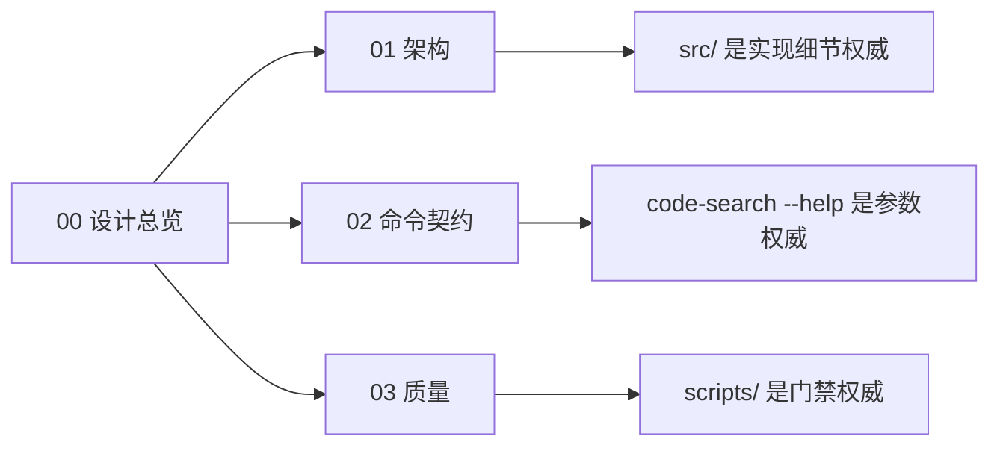
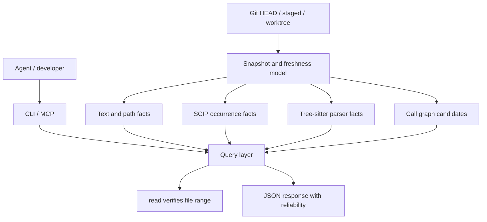

# 设计总览

> 长期设计入口。本文记录稳定边界；过程记录、任务拆解、计划和一次性报告不放在 `docs/`。

## 阅读地图

| 文档 | 保留内容 | 不保留内容 |
| --- | --- | --- |
| `00-design-summary.md` | 产品定位、系统图、文档规则 | 历史决策过程 |
| `01-architecture.md` | snapshot/index/query/freshness 边界 | 模块逐行说明 |
| `02-command-contract.md` | Agent 依赖的 JSON 与 reliability 契约 | 每个 flag 的重复清单 |
| `03-quality.md` | 验证入口和门禁分层 | 临时测试记录 |

## 产品定位

`code-search` 是本地优先、Git 优先的代码搜索与跳转工具，目标是让 Agent 像使用 IDE 一样获取窄而可靠的代码证据。

它提供：

- 内容搜索、路径搜索、目录浏览和范围读取。
- 定义、引用、符号、调用候选和变更状态。
- 本地索引、Git hook、watcher、remote pack/unpack 和 MCP 入口。
- 每个响应的 snapshot、producer、freshness 与 reliability 信息。

它不承诺：

- 默认 embedding 或语义相似度搜索。
- 把启发式调用图伪装成精确事实。
- 用 remote 结果覆盖本地 dirty/staged 状态。
- 用 watcher 替代 Git hook 或 staged/commit snapshot。
- 在文档里复制源码已经能说明的模块和参数细节。

## 系统图

索引是加速层，不是事实源。事实源始终是本地源码、Git 状态、文件 hash 和可读取的 range。

## 可靠性

| level | 来源 | `exact` | 使用方式 |
| --- | --- | --- | --- |
| `source_fact` | 文件系统、Git、文本和路径匹配 | `true` | 可作为源码证据；编辑前仍用 `read` 取精确范围 |
| `precise_fact` | SCIP、语言服务或编译器索引 | `true` | 可作为 IDE 级跳转事实；仍保留 range verification |
| `parser_fact` | tree-sitter AST | `false` | 确定的语法事实，不等于语义精确引用 |
| `inferred_candidate` | 图、AST heuristic、search-based inference | `false` | 只用于缩小范围，必须二次验证 |
| `freshness` | manifest、hash、watcher、index status | `false` | 描述缓存状态，不提升代码事实准确性 |
| `remote_unverified` | 未能与本地文件对齐的 remote snapshot | `false` | 只能作为线索，不能直接用于编辑决策 |

## 文档规则

- `docs/` 只放长期 Markdown 设计文档。
- 过程型文件不进入仓库文档：`task`、`plan`、`roadmap`、MR 执行记录、一次性 benchmark/test report 都应外置。
- 图优先，长段落从简；能由源码、测试或脚本说明的问题不写二次文档。
- 文档描述边界和契约，不描述每个函数的实现细节。
- 新增文档必须能被上面的阅读地图解释；不能解释就不要新增。
