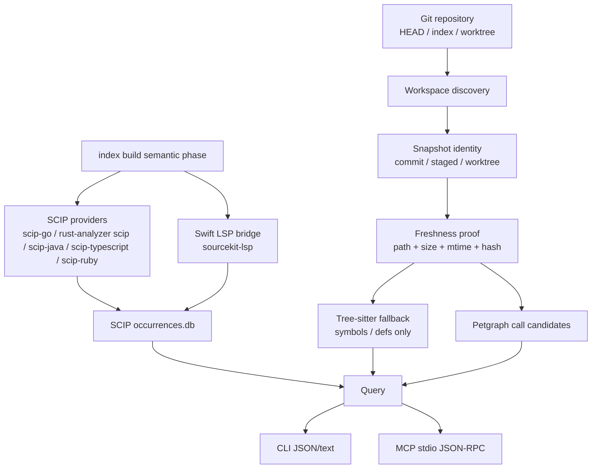
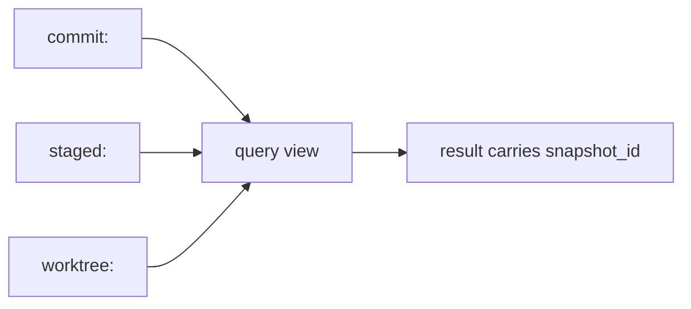
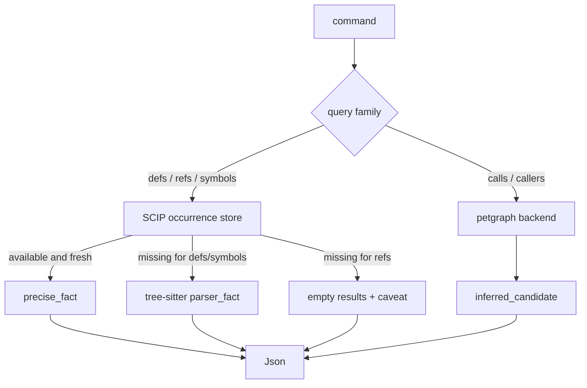
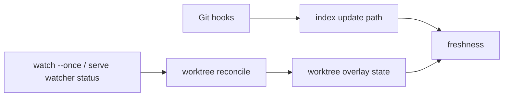
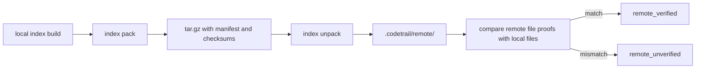
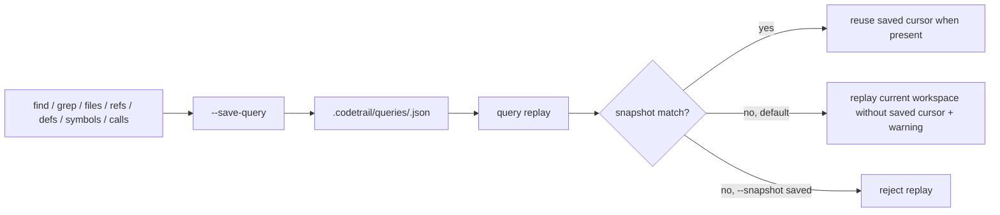

# 架构

> 本文只描述长期结构边界。当前模块名、函数名和参数以 `src/` 为准。

## 总体分层



设计重点是分层，而不是把所有能力塞进一个“代码图”。新的公共策略面只暴露 precise occurrence、parser symbol/def fallback 和调用候选。文本/路径搜索由 `rg`、`fd` 和宿主工具承担。

## Snapshot 模型



规则：

- `commit`、`staged`、`worktree` 不能混成无来源结果。
- 索引记录必须能回到 `snapshot_id`、`path`、`file_hash` 和 `range`。
- freshness 失败时，查询必须回退到实时读取，或返回明确的 stale/error 信息。
- dirty worktree 可以按文件混合：未变更且 proof 匹配的文件继续走 fresh index，变更或新增文件走 live overlay，并在结果上暴露 producer/source reason。
- remote snapshot 只能加速或共享；不能覆盖本地 dirty/staged 事实。

## 存储边界

```text
.codetrail/
  index.lance/              # legacy file catalog / compatibility storage
  working/manifest.json     # snapshot and compatibility metadata
  staged/manifest.json
  scip/<snapshot-key>/      # occurrences.db + generation.json
  graph/<snapshot-key>/     # petgraph.bin + graph manifest
```

当前语义索引以 SCIP occurrence DB 和 graph manifest 为主。LanceDB/file catalog 仍存在于实现中，主要用于兼容、内部测试和旧命令，不是新公共策略面的核心。

## 查询路径



`refs` 是 precise-only：没有 fresh SCIP occurrence 时不做文本 fallback。`defs`
和 `symbols` 可以使用 tree-sitter 作为语法事实。`calls` 和 `callers` 始终是候选关系。
文本/路径 discovery 不属于新的公共查询路径。

## Legacy Watcher 和 Hook



- Hook 和 watcher 属于 legacy/compatibility 层，不是语义索引前端的公共策略面。
- Hook 维护 Git 语义相关的 staged/commit 索引。
- Watcher 只维护 worktree overlay 和实时性状态。
- Watcher 不执行 `git add`，不修改 staged，不生成 commit snapshot。
- 当前 `watch --once` 是按需 reconcile；`serve` 暴露 query service 状态和 watcher 状态。

## 语义索引（Provider → SCIP）

`index build` 默认 best-effort 启动语义 provider。Go、Rust、Java/Kotlin、TypeScript/JavaScript 和 Ruby 优先使用 native SCIP provider（`scip-go`、`rust-analyzer scip .`、`scip-java index`、`scip-typescript index`、`scip-ruby .`）；Swift 继续使用 `sourcekit-lsp` bridge 合成 SCIP occurrence。所有 provider 产物会先写入 `.codetrail/scip/<snapshot-key>/provider-output/`，合并后在同一 build 阶段导入 `.codetrail/scip/<snapshot-key>/occurrences.db`。

- `--no-semantic` 跳过该阶段；`index build --staged` 不运行语义阶段。
- 任何 provider 失败只产生 partial/missing manifest 与 caveat，不阻塞 build；`defs`/`symbols` 可回退到 tree-sitter parser，`refs` 返回缺少 precise index 的 caveat。
- 环境变量：`CODETRAIL_SCIP_<LANG>` 覆盖 native SCIP provider 命令；Swift 使用 `CODETRAIL_LSP_SWIFT` 覆盖 `sourcekit-lsp`；`CODETRAIL_SEMANTIC_BUDGET_MS` 控制总墙钟预算（默认 60s）。
- Kotlin 使用 `CODETRAIL_SCIP_KOTLIN`，未设置时回退 `CODETRAIL_SCIP_JAVA`。同一 Gradle root 同时有 Java/Kotlin source 时，`scip-java index` 按 provider/root/command 分组只运行一次。
- 若 `occurrences.db` 已与当前 snapshot 和 file hash 对齐，重复 build 会跳过语义阶段。
- SwiftPM root 直接通过 `sourcekit-lsp` 尝试语义索引；Xcode root 只读取已有
  `buildServer.json` 或 `compile_commands.json` 状态并在 `index status`
  中报告，不会自动运行 `xcode-build-server config` 或写入配置文件。

## Legacy Remote



Remote pack/unpack 属于 legacy/compatibility 层，不是新的公共语义索引前端。远端或共享缓存不能覆盖本地 dirty/staged/worktree 事实；调用方需要用宿主源码读取工具重新验证可编辑源码。

## Legacy Saved Query



Saved query 属于 legacy/compatibility 层，不是新的公共语义索引前端。历史数据仍只保存可重放命令、query 参数、scope、snapshot 和 cursor 元数据，不保存结果正文。
