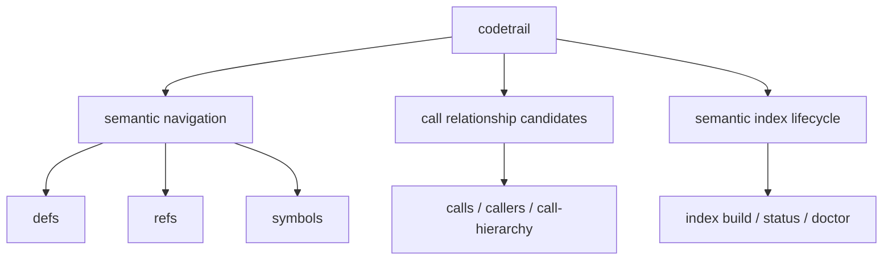
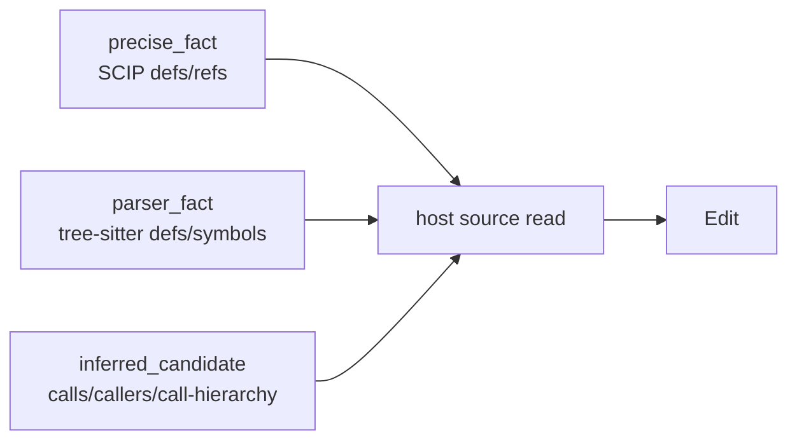

# 命令契约

> 命令参数以 `codetrail --help` 和 `src/cli.rs` 为准。本文描述调用方可以依赖的稳定命令和 JSON 契约。

## 稳定命令族

CodeTrail 的公共定位收敛为 SCIP/语义索引前端，只解决普通 bash 搜索难以可靠回答的符号、引用和调用链问题。



| 族 | 命令 | 契约 |
| --- | --- | --- |
| 符号与定义 | `symbols`, `defs` | 优先 fresh SCIP；缺失时可使用 tree-sitter parser fallback，可靠性为 `parser_fact` |
| 精确引用 | `refs` | 只返回 fresh SCIP occurrence 引用；没有可用 SCIP 时返回空结果，不做文本 fallback |
| 调用关系 | `calls`, `callers`, `call-hierarchy` | 返回调用候选或 call hierarchy；结果是导航证据，可能不完整，编辑前必须复核调用点 |
| 索引 | `index build`, `index status`, `index doctor` | 构建、查看和诊断语义索引/SCIP provider 状态 |

旧的文本、路径、route、watch、serve、saved-query、remote pack/unpack、hook 等命令仍可能留在实现中用于兼容、测试或内部维护，但不属于新的公共策略面。Agent 和 MCP 不应把 CodeTrail 当作 `rg`、`fd`、`cat`、`git` 或编辑器读取工具的替代品。

任务级调查不属于命令族。`brief`、`context`、`explore node`、`analyze architecture` 或 `analyze data-model` 这类行为应由宿主 Agent 通过普通工具和上述语义原语组合完成，不进入 CodeTrail 的公共命令契约。

## 共享 Scope

稳定语义命令共享 workspace scope：

```bash
codetrail --dir src/main --ext java --file-pattern '*Service.java' defs UserService
```

- `--path <workspace>` / `-p <workspace>` 选择 workspace root，是全局参数，可放在子命令前后。
- `--output text|json|jsonl|compact-json` 选择响应格式，是全局参数，可放在子命令前后；`output` 不表示文件写入目标。
- `--dir <dir>` 可重复，始终按 workspace root 解析，多个目录为 OR。规范输入是 workspace-relative；为兼容旧 agent 调用，workspace 内的绝对目录会归一化为 workspace-relative；workspace 外、逃逸、缺失或非目录路径会被拒绝。不要把 workspace 绝对路径传给 `--dir`。
- `--ext <ext>` 可重复，接受 `java` 或 `.java`，按路径后缀字符串匹配。
- `--file-pattern <pattern>` 可重复，多个 pattern 为 OR。
- `--file-mode literal|regex|wildcard|glob` 控制 `--file-pattern`，默认 `wildcard`。
- `--case-sensitive` 和 `--ignore-case` 互斥；默认 ignore-case。
- `--lang <lang>` 按扩展名映射出的语言名过滤，大小写不敏感。
- `--cursor <cursor>` 是不透明分页 token，只能用于相同 query scope 和 snapshot。

`--changed`、`--save-query` 等 legacy 选项可能仍被旧命令使用，但不应成为语义索引前端的新依赖。

命令自己的文件或目录目标不得复用全局参数名：例如 project-scope `skill install` 使用 `--project-root <DIR>`，`index pack` 使用 `--archive <ARCHIVE>`。

## 标识符输入

`defs`、`refs`、`symbols`、`calls`、`callers` 和 `call-hierarchy` 默认使用
`--input-mode compatible`。调用方可以传 simple name、`Class.method`、
`findUser(Long)`、`Class.findUser(Long)`、snake_case 或 kebab-case style key。
兼容模式会一次性生成有限候选集合并在已抽取的 symbol/call 名上匹配，不做编辑距离 fuzzy。需要精确原样匹配时使用 `--input-mode strict`。

这些命令的 CLI 参数面都是单个字符串：

```bash
codetrail refs <identifier>
codetrail defs <identifier>
codetrail symbols <query>
codetrail calls <caller-name>
codetrail callers <callee-name>
codetrail call-hierarchy <identifier> [--direction incoming|outgoing|both] [--depth <n>] [--include-overrides]
```

如果字符串包含空格、括号或 shell 特殊字符，调用方必须按普通 shell 规则加引号；以 `-` 开头的值应放在 `--` 之后。

- `refs <identifier>` 查 fresh SCIP occurrence。它匹配 exact display name、SCIP symbol、symbol key，以及不带签名的 bare method name。没有可用 SCIP 时返回空结果；调用方如果只需要文本出现位置，应使用 `rg`。
- `defs <identifier>` 和 `symbols <query>` 优先 SCIP；缺失时可返回 parser fallback 的定义/符号事实。
- `calls <caller-name>` 查询某个函数或方法体内发出的调用。
- `callers <callee-name>` 查询调用某个目标的调用点。
- `call-hierarchy <identifier>` 查询 incomingCalls/outgoingCalls 结构化调用层级，默认 `--depth 2`。Java 优先使用 fresh Java semantic index；其他语言和 Java fallback 使用 fresh graph index。`--include-overrides` 只在当前 semantic index 支持 override/implementation expansion 时生效。缺失时返回空结果和 freshness 说明。公开层级只返回已解析的 callable 节点并显示签名；方法、函数和构造器会显示，没解析到声明位置的裸调用点不作为 hierarchy function 返回。Text 输出采用 `Class.method(args)  (package)` 或语言原始函数签名，root 用 `def@path:line` 标明声明位置，子调用按调用点文件分块并用 `call@line` 标明调用位置。
- `calls`/`callers`/`call-hierarchy` 无论来自 Java semantic index、graph 还是 parser，都只是候选关系。
- 兼容输入命中时结果会带 `matchedInputVariant`；内部诊断可记录输入扩展，但 public JSON 不暴露诊断字段。

`symbols` 和 `defs` 支持显式源码上下文：

```bash
codetrail symbols <query> --include-code [--code-context <lines>] [--code-max-lines <lines>]
codetrail defs <identifier> --include-code [--code-context <lines>] [--code-max-lines <lines>]
```

该源码上下文是导航证据，不替代编辑前的宿主源码读取。

## Index Build 与 Doctor

- `index build` 默认 best-effort 运行 provider 语义阶段，生成并导入 `.codetrail/scip/<snapshot-key>/occurrences.db`，同时为 Java 源码构建 Rust-native `.codetrail/java-semantic.sqlite` 结构化语义索引。Java semantic 查询直接走 SQLite 索引。
- `--no-semantic` 关闭 provider/SCIP 生成；`index build --staged` 不运行语义阶段。
- `index status` 返回索引 freshness、SCIP occurrence DB 状态、provider 状态和语言覆盖。
- `index status --summary` 返回紧凑状态，适合脚本预检。
- `index doctor` 面向语义索引前端，突出 precise index 是否 fresh/usable、provider 状态、语言覆盖和下一步动作。
- 内部/测试用 remote snapshot 命令中，`index pack --archive <ARCHIVE>` 写出 `.tar.gz` 归档；`index unpack <ARCHIVE>` 读取该归档。命令 query 参数字段使用 `archive`，结果路径字段使用 `archivePath`，不使用 `output` 表示文件目标。

Provider 缺失或超时时会记录内部诊断。`defs`/`symbols` 可以退到 parser；`refs` 不退到文本引用。

每语言的 provider 命令与 env 覆盖由 `index doctor` 输出给出，不进入默认 skill。例如 Kotlin 使用 `scip-java`，优先 `CODETRAIL_SCIP_KOTLIN`、回退 `CODETRAIL_SCIP_JAVA`；precise setup 缺失时 Kotlin 仅 `defs`/`symbols` 退到 `tree_sitter_parser`，`refs` 不退到文本。

## MCP 契约

MCP `tools/list` 只暴露语义索引相关工具：

- `codetrail_defs`
- `codetrail_refs`
- `codetrail_symbols`
- `codetrail_calls`
- `codetrail_callers`
- `codetrail_call_hierarchy`
- `codetrail_status`

旧的 MCP text/path/route/explore 工具不再出现在 `tools/list`。直接调用这些旧工具会返回 tool error。MCP tool result 的 `content[0].text` 使用同一 public JSON 投影。

## 输出契约

默认输出是短文本，面向真实终端阅读。需要机器读取时显式传 `--output json` 或 `--output jsonl`。

公开成功 JSON 只保留两类信息：

```json
{
  "results": [],
  "page": {
    "truncated": false,
    "nextCursor": null
  }
}
```

稳定字段：

- `results` 是唯一的主要结果载体。每条结果只保留定位、文本、符号、关系或命令结果本身需要的字段；内部审计字段、producer、source target、index freshness 和 agent next action 不进入公开 JSON。
- `symbols/defs --include-code` 的每条结果可包含 `source` 和 `relations`；relation 条目只保留公开定位和候选关系字段。宽名或多组候选导致结果明显模糊时，`source` 只附加到排序最高的少量候选，其余候选保留定位 metadata，并通过 `ambiguous_include_code_capped` warning 标记。
- `page.truncated` 表示本次输出被裁切或分页，调用方应缩小查询或使用 `page.nextCursor` 翻页。
- `page.nextCursor` 是下一页游标；没有下一页时为 `null`。
- 失败 JSON 仍保留结构化 `error.code` / `error.message`，同时带空 `results` 和 `page`。
- 内部 `warnings`、`reliability` 和诊断字段可继续用于测试和调试，但不进入 public JSON。

`--output compact-json` 是兼容别名，输出同一公开 JSON 形态；它不是 status 摘要模式。

`--output jsonl` 使用逐行事件：

```json
{"event":"result","result":{}}
{"event":"page","page":{"truncated":false,"nextCursor":null}}
```

错误不会恢复旧 envelope；JSON 输出为 `results: []`、`page` 和结构化 `error`，JSONL 输出单条 `error` event。

## 可靠性流转



规则：

- `exact=true` 只允许出现在 `source_fact` 或 `precise_fact`。
- `parser_fact` 可以是确定性语法事实，但不能代表 precise semantic reference resolution。
- `refs` 没有 fresh SCIP occurrence 时不得伪装为语义引用，也不得自动把文本匹配标成 reference。
- `calls`、`callers` 和 `call-hierarchy` 即使来自 Java semantic index 或图索引，也必须标为候选。
- 开发者修改代码前仍应通过宿主编辑器或 Agent read 工具读取关键结果的精确范围。

## Text 输出

默认 text 输出保持短、可审计、不过度设计：

- `calls`/`callers` 按 caller -> callee 关系渲染，关系和位置保持同一行。
- `symbols/defs` 默认结果行包含 kind、name 和位置，保持一行可跳转。
- `symbols/defs --include-code` 会在 symbol/def 行下渲染带行号的 source block，并附简短 calls/callers 摘要；模糊结果可能只为 top ranked 候选渲染 source block，以控制输出量。JSON/JSONL 仍是该能力的主契约。
- `index build` 和 `index-provider install` 在 TTY 上显示加载进度；非 TTY 保持无 spinner，避免污染脚本输出。
- 不渲染诊断提示块；能力边界放在 help 和文档中，内部审计、agent next action 或完整 schema 不打到终端。

## 退出码

| code | 含义 |
| --- | --- |
| `0` | 命令成功 |
| `1` | 参数、用法或内部执行错误 |
| `2` | 查询完成但没有匹配或缺少 required precise index |
| `6` | 索引存在但 freshness/verify 失败 |

其它错误码由实现按错误类型继续细化；脚本和 CI 应优先检查 JSON 与进程退出状态。
