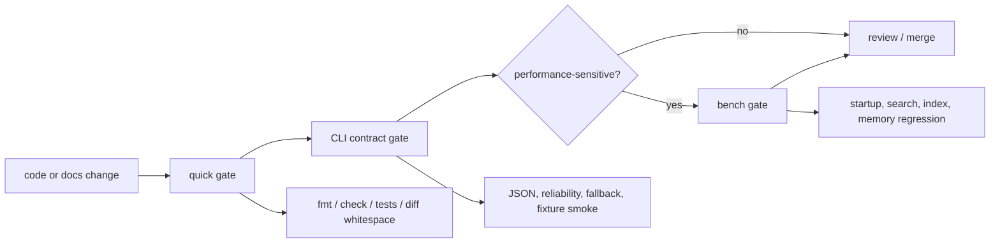
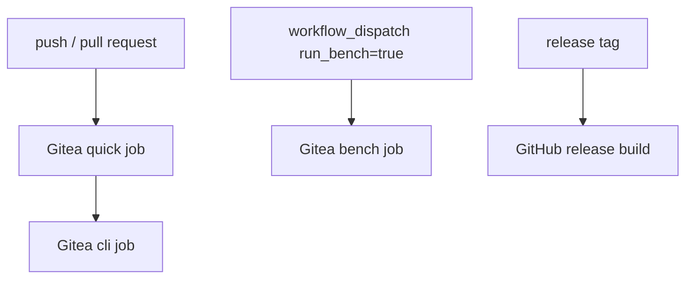

# 质量

> 本文保留验证入口和门禁边界。具体检查命令以 `scripts/quality-gate.sh` 和 CI 配置为准。

## 验证流



统一入口：

```bash
scripts/quality-gate.sh quick
scripts/quality-gate.sh cli
scripts/quality-gate.sh bench
scripts/quality-gate.sh full
```

## 门禁分层

| 层级 | 保护对象 | 入口 |
| --- | --- | --- |
| 静态卫生 | 格式、编译、diff whitespace | `quick` |
| 单元行为 | parser、index、watcher、query helpers | `cargo test --lib` 或 `quick` |
| CLI 契约 | JSON schema、reliability、exit code、fallback | `cargo test --test cli` 或 `cli` |
| 真实仓库 smoke | Agent 常用 L0 命令 | `cli`，当 `TEST_REPO` 存在时运行 |
| 性能回归 | 启动、搜索、索引、内存 | `bench` |

## CI 映射



- `.gitea/workflows/quality-gate.yml` 调度质量门禁。
- `.github/workflows/release.yml` 只负责 release artifact 构建。
- CI 不应重新发明测试规则；新增规则先进入脚本，再由 CI 调度。

## 质量信号

| 信号 | 失败含义 |
| --- | --- |
| Schema drift | Agent 依赖字段缺失、改名或类型漂移 |
| Reliability drift | 候选结果被标成 exact，或 precise/parser/source 边界混淆 |
| Freshness bypass | stale index 被继续使用，或 fallback 未显式声明 |
| Snapshot confusion | HEAD、staged、worktree 结果混用 |
| Remote mismatch | remote 结果未标注 verified/unverified |
| Performance regression | 常用搜索、索引或启动路径超过阈值 |

## 文档质量规则

- 设计文档只描述长期边界和图示，不记录执行过程。
- benchmark 原始结果、临时 HTML 报告和一次性评估输出不提交到 `docs/`。
- 新增命令或 JSON 字段时，先补 CLI contract 测试，再更新 `02-command-contract.md` 的稳定契约。
- 新增索引、remote、watcher 或 graph 行为时，先补 freshness/reliability 断言，再更新 `01-architecture.md`。
